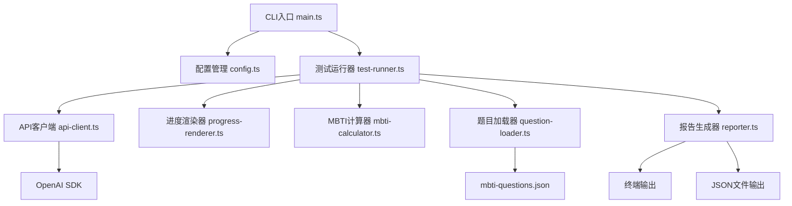
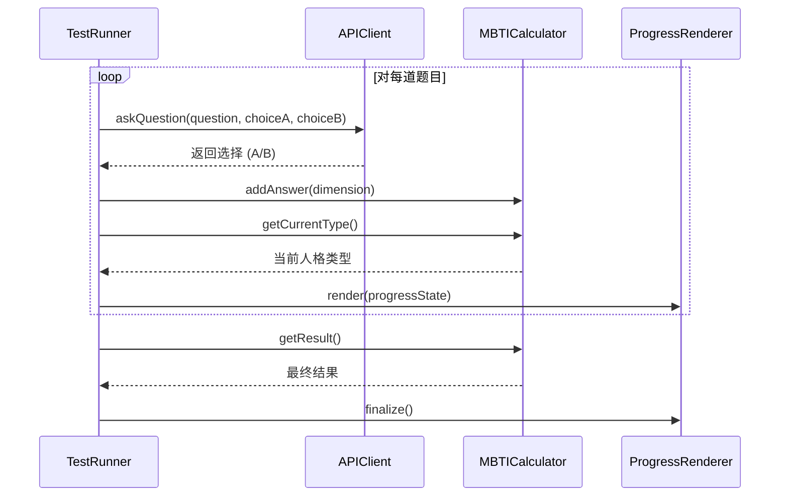

# 设计文档

## 概述

llm-mbti-arena 是一个TypeScript命令行工具，用于对大语言模型进行MBTI人格测试。系统采用模块化架构，将API调用、测试执行、进度渲染和结果计算分离为独立模块。工具通过OpenAI SDK与兼容OpenAI API的模型进行交互，逐题提问并解析回答，最终生成人格类型报告。

## 架构

### 系统架构图



### 模块职责

1. **CLI入口（main.ts）**：解析命令行参数，协调各模块执行
2. **配置管理（config.ts）**：读取和验证环境变量配置
3. **题目加载器（question-loader.ts）**：加载和验证MBTI测试题目
4. **API客户端（api-client.ts）**：封装OpenAI SDK，处理模型调用
5. **测试运行器（test-runner.ts）**：核心测试流程控制
6. **进度渲染器（progress-renderer.ts）**：实时显示测试进度和统计
7. **MBTI计算器（mbti-calculator.ts）**：计算人格维度和类型
8. **报告生成器（reporter.ts）**：生成终端和JSON格式报告

## 组件和接口

### 1. 配置管理（config.ts）

#### 接口定义

```typescript
interface Config {
  apiUrl: string;
  apiKey: string;
  modelName: string;
}

function loadConfig(): Config;
function validateConfig(config: Config): void;
```

#### 功能描述

- 从环境变量读取 `LLMMBIT_API`、`LLMMBIT_API_KEY`、`LLMMBIT_API_MODEL`
- 验证必需配置项是否存在
- 提供默认值处理（如API URL默认为OpenAI官方地址）
- 配置验证失败时抛出清晰的错误信息

### 2. 题目加载器（question-loader.ts）

#### 接口定义

```typescript
interface Choice {
  value: string;  // E, I, S, N, T, F, J, P
  text: string;
}

interface Question {
  question: string;
  choice_a: Choice;
  choice_b: Choice;
}

function loadQuestions(): Question[];
function validateQuestions(questions: Question[]): void;
```

#### 功能描述

- 从 `src/datasets/mbti-questions.json` 加载题目
- 验证JSON格式和必需字段
- 确保每个choice的value是有效的MBTI维度标识

### 3. API客户端（api-client.ts）

#### 接口定义

```typescript
interface APIClientOptions {
  apiUrl: string;
  apiKey: string;
  modelName: string;
}

class APIClient {
  constructor(options: APIClientOptions);
  
  async askQuestion(
    question: string,
    choiceA: string,
    choiceB: string
  ): Promise<string>;
}
```

#### 功能描述

- 使用OpenAI SDK初始化客户端
- 支持自定义baseURL以兼容其他OpenAI风格API
- 构造提示词，要求模型在A和B之间选择
- 解析模型响应，提取选择结果
- 处理API调用异常（超时、限流等）

#### 提示词设计

```
请根据你的倾向回答以下问题，选择更符合你的选项。

问题：{question}

选项：
A. {choice_a_text}
B. {choice_b_text}

请只回答 A 或 B。
```

**设计理由**：不告知模型这是MBTI测试，避免模型基于对MBTI理论的了解而刻意调整回答，从而获得更自然、更真实的人格倾向结果。

### 4. MBTI计算器（mbti-calculator.ts）

#### 接口定义

```typescript
type Dimension = 'E' | 'I' | 'S' | 'N' | 'T' | 'F' | 'J' | 'P';

interface DimensionScores {
  E: number;
  I: number;
  S: number;
  N: number;
  T: number;
  F: number;
  J: number;
  P: number;
}

interface PersonalityResult {
  scores: DimensionScores;
  percentages: {
    E_I: { E: number; I: number };
    S_N: { S: number; N: number };
    T_F: { T: number; F: number };
    J_P: { J: number; P: number };
  };
  type: string;  // 如 "ENFP"
}

class MBTICalculator {
  private scores: DimensionScores;
  
  addAnswer(dimension: Dimension): void;
  getCurrentType(): string;
  getResult(): PersonalityResult;
  getScores(): DimensionScores;
}
```

#### 功能描述

- 维护八个维度的累计分数
- 实时计算当前倾向的人格类型
- 计算每个维度对的百分比
- 根据分数确定最终的四字母人格类型

#### 计算逻辑

- 每个回答为对应维度+1分
- 百分比计算：`E% = E / (E + I) * 100`
- 人格类型确定：每对维度选择分数较高的字母

### 5. 进度渲染器（progress-renderer.ts）

#### 接口定义

```typescript
interface ProgressState {
  currentQuestion: number;
  totalQuestions: number;
  scores: DimensionScores;
  currentType: string;
}

class ProgressRenderer {
  render(state: ProgressState): void;
  clear(): void;
  finalize(): void;
}
```

#### 功能描述

- 使用ANSI转义码实现终端动态更新
- 显示题目进度（如"题目 15/93"）
- 显示进度条（使用字符如 `[=====>    ]`）
- 显示八个维度的实时分数
- 显示当前倾向的人格类型
- 支持清除和重绘以实现动态效果

#### 渲染布局

```
正在测试模型：openai/gpt-4o

进度：题目 15/93
[===============>                                        ] 16%

当前人格倾向：ENFP

维度统计：
  E (外向型): 8  |  I (内向型): 2
  S (感觉型): 3  |  N (直觉型): 7
  T (思考型): 4  |  F (感情型): 6
  J (判断型): 5  |  P (感知型): 5
```

### 6. 测试运行器（test-runner.ts）

#### 接口定义

```typescript
interface TestResult {
  modelName: string;
  testTime: string;
  answers: Array<{
    questionIndex: number;
    question: string;
    chosenOption: 'A' | 'B';
    dimension: Dimension;
  }>;
  personalityResult: PersonalityResult;
}

class TestRunner {
  constructor(
    apiClient: APIClient,
    questions: Question[],
    progressRenderer: ProgressRenderer,
    calculator: MBTICalculator
  );
  
  async run(): Promise<TestResult>;
}
```

#### 功能描述

- 协调整个测试流程
- 逐题调用API客户端获取回答
- 更新MBTI计算器
- 触发进度渲染器更新
- 收集所有回答记录
- 处理测试过程中的错误
- 返回完整的测试结果

#### 执行流程



### 7. 报告生成器（reporter.ts）

#### 接口定义

```typescript
interface ReportOptions {
  format: 'console' | 'json';
  outputPath?: string;
}

class Reporter {
  generateConsoleReport(result: TestResult): void;
  generateJSONReport(result: TestResult): string;
  saveReport(content: string, path: string): void;
}
```

#### 功能描述

- 生成美观的终端报告
- 生成结构化的JSON报告
- 支持将报告保存到文件
- 格式化百分比和统计数据

#### 终端报告格式

```
=====================================
    MBTI 人格测试报告
=====================================

测试模型：openai/gpt-4o
测试时间：2025-10-06 14:30:25

最终人格类型：ENFP

维度百分比：
  外向型 (E): 65%  |  内向型 (I): 35%
  直觉型 (N): 72%  |  感觉型 (S): 28%
  感情型 (F): 58%  |  思考型 (T): 42%
  感知型 (P): 61%  |  判断型 (J): 39%

总题目数：93
测试完成！
=====================================
```

#### JSON报告格式

```json
{
  "modelName": "openai/gpt-4o",
  "testTime": "2025-10-06T14:30:25.000Z",
  "personalityType": "ENFP",
  "percentages": {
    "E_I": { "E": 65, "I": 35 },
    "S_N": { "S": 28, "N": 72 },
    "T_F": { "T": 42, "F": 58 },
    "J_P": { "J": 39, "P": 61 }
  },
  "answers": [
    {
      "questionIndex": 0,
      "question": "当你要外出一整天，你会",
      "chosenOption": "A",
      "dimension": "J"
    }
    // ... 更多回答
  ]
}
```

### 8. CLI入口（main.ts）

#### 功能描述

- 使用 `commander` 库解析命令行参数
- 定义 `--bench` 和 `--json-report` 选项
- 显示帮助信息
- 初始化所有模块
- 处理顶层异常
- 控制程序退出码

#### 命令行接口

```bash
llmmbtibenchmark                    # 显示帮助
llmmbtibenchmark --help             # 显示帮助
llmmbtibenchmark --bench            # 运行测试，终端显示
llmmbtibenchmark --bench --json-report  # 运行测试，JSON输出
```

## 数据模型

### 核心数据流

```mermaid
flowchart LR
    A[mbti-questions.json] --> B[Question[]]
    B --> C[TestRunner]
    C --> D[API Response]
    D --> E[Answer Record]
    E --> F[MBTICalculator]
    F --> G[PersonalityResult]
    G --> H[Report]
```

### 状态管理

测试过程中的状态由 `TestRunner` 维护：
- 当前题目索引
- 所有回答记录
- MBTI计算器实例（维护累计分数）
- 测试开始时间

## 错误处理

### 错误类型和处理策略

1. **配置错误**
   - 场景：环境变量缺失或无效
   - 处理：启动时验证，显示错误信息并退出
   - 退出码：1

2. **文件加载错误**
   - 场景：题目文件不存在或JSON格式错误
   - 处理：显示错误信息并退出
   - 退出码：2

3. **API调用错误**
   - 场景：网络错误、认证失败、限流
   - 处理：
     - 显示错误信息
     - 提供重试选项（最多3次）
     - 重试失败后跳过该题目并记录
   - 继续测试

4. **响应解析错误**
   - 场景：模型返回无法解析的内容
   - 处理：
     - 尝试模糊匹配（查找"A"或"B"）
     - 失败则记录为"无效回答"
     - 继续下一题

5. **未预期错误**
   - 场景：其他运行时错误
   - 处理：捕获异常，显示堆栈信息，退出
   - 退出码：255

### 错误日志

- 使用简单的日志输出到stderr
- 包含时间戳和错误级别
- 不影响JSON报告输出（输出到stdout）

## 测试策略

### 单元测试

使用 `vitest` 进行单元测试，覆盖以下模块：

1. **MBTICalculator**
   - 测试分数累加
   - 测试百分比计算
   - 测试人格类型判定
   - 边界情况（分数相等时的处理）

2. **QuestionLoader**
   - 测试正常加载
   - 测试格式验证
   - 测试错误处理

3. **Reporter**
   - 测试终端报告格式
   - 测试JSON报告结构
   - 测试数据转换

4. **Config**
   - 测试环境变量读取
   - 测试验证逻辑
   - 测试默认值

### 集成测试

1. **端到端测试**
   - 使用mock API客户端
   - 测试完整测试流程
   - 验证最终报告正确性

2. **API集成测试**
   - 使用真实API（可选，需要API密钥）
   - 测试与OpenAI API的兼容性

### 测试数据

- 创建小型测试题目集（10题）用于快速测试
- 使用固定的模拟回答验证计算逻辑

## 依赖项

### 生产依赖

```json
{
  "openai": "^4.0.0",           // OpenAI SDK
  "commander": "^11.0.0",       // CLI参数解析
  "chalk": "^5.0.0"             // 终端颜色输出
}
```

### 开发依赖

```json
{
  "typescript": "^5.0.0",
  "vitest": "^1.0.0",           // 测试框架
  "@types/node": "^20.0.0",
  "tsx": "^4.0.0",              // TypeScript执行器
  "tsup": "^8.0.0"              // 打包工具
}
```

## 构建和部署

### 项目结构

```
llm-mbti-arena/
├── src/
│   ├── main.ts                 # CLI入口
│   ├── config.ts               # 配置管理
│   ├── api-client.ts           # API客户端
│   ├── test-runner.ts          # 测试运行器
│   ├── progress-renderer.ts    # 进度渲染
│   ├── mbti-calculator.ts      # MBTI计算
│   ├── question-loader.ts      # 题目加载
│   ├── reporter.ts             # 报告生成
│   ├── types.ts                # 类型定义
│   └── datasets/
│       └── mbti-questions.json # 测试题目
├── tests/
│   ├── mbti-calculator.test.ts
│   ├── question-loader.test.ts
│   └── reporter.test.ts
├── package.json
├── tsconfig.json
├── vitest.config.ts
└── README.md
```

### 构建配置

使用 `tsup` 打包为单个可执行文件：

```typescript
// tsup.config.ts
export default {
  entry: ['src/main.ts'],
  format: ['esm'],
  target: 'node18',
  clean: true,
  minify: false,
  bundle: true,
  outDir: 'dist',
  platform: 'node'
}
```

### package.json 配置

```json
{
  "name": "llm-mbti-arena",
  "version": "1.0.0",
  "type": "module",
  "bin": {
    "llmmbtibenchmark": "./dist/main.js"
  },
  "scripts": {
    "build": "tsup",
    "dev": "tsx src/main.ts",
    "test": "vitest run",
    "test:watch": "vitest"
  }
}
```

### 安装和使用

```bash
# 开发模式
npm run dev -- --bench

# 构建
npm run build

# 全局安装
npm install -g .

# 使用
llmmbtibenchmark --bench
```

## 性能考虑

1. **API调用优化**
   - 使用合理的超时设置（30秒）
   - 实现请求重试机制
   - 考虑添加请求间隔以避免限流

2. **进度渲染优化**
   - 使用ANSI转义码避免频繁清屏
   - 限制渲染频率（如每题渲染一次）

3. **内存管理**
   - 流式处理题目（虽然93题数据量小）
   - 及时释放不需要的数据

## 扩展性设计

### 未来可能的扩展

1. **支持更多测试类型**
   - 抽象测试框架，支持其他心理测试
   - 插件化题目加载器

2. **并发测试**
   - 支持同时测试多个模型
   - 生成对比报告

3. **结果可视化**
   - 生成图表（雷达图、柱状图）
   - 导出HTML报告

4. **历史记录**
   - 保存测试历史
   - 追踪模型人格变化

5. **自定义题目**
   - 支持用户提供自定义题目集
   - 题目权重配置
