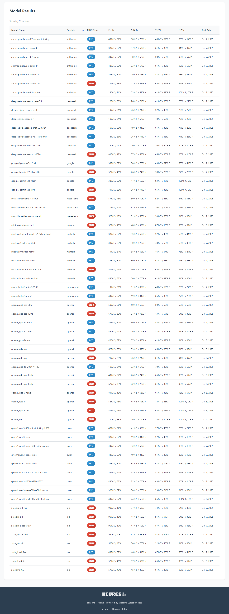
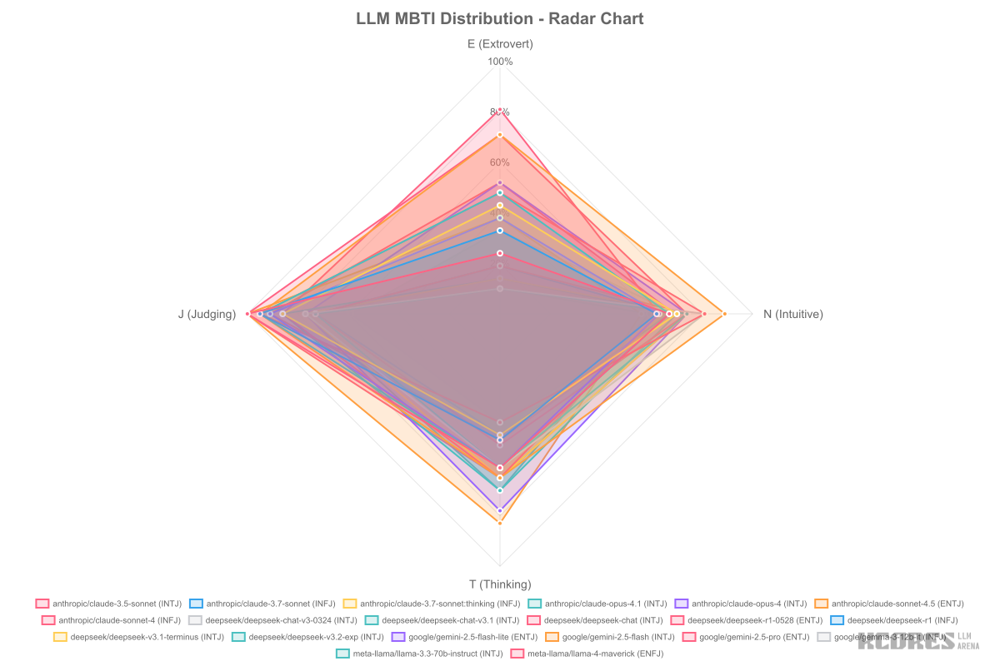

# LLM MBTI Arena


一个用于测试大语言模型（LLM）人格类型的命令行工具。通过标准的 MBTI（Myers-Briggs Type Indicator）测试题目与大模型进行交互，分析其回答倾向，最终得出模型的 16 型人格类型。



## 特性

- 🤖 支持所有 OpenAI 风格的 API 接口
- 📊 实时显示测试进度和人格数据累计
- 🎨 美观的终端界面和彩色输出
- 📄 支持终端和 JSON 格式的测试报告
- 🧪 基于 93 道标准 MBTI 测试题目
- 🔄 自动重试机制，确保测试稳定性
- ⚡ 支持并发请求，加速测试过程（默认并发数：5）
- 🎯 JSON 格式响应解析，提高准确性
- 📈 自动生成可视化报告和交互式 Web 界面
- 🤖 GitHub Actions 自动化更新可视化内容


<!-- AUTO-GENERATED-VISUALIZATION-START -->
## MBTI 分布可视化



查看 [交互式报告](#) 了解更多详情。
<!-- AUTO-GENERATED-VISUALIZATION-END -->

## 安装

### 前置要求

- Node.js >= 18.0.0
- npm 或其他包管理器

### 从源码安装

```bash
# 克隆仓库
git clone <repository-url>
cd llm-mbti-arena

# 安装依赖
npm install

# 构建项目
npm run build

# 全局安装（可选）
npm install -g .
```

## 配置

### 环境变量

在使用工具之前，需要配置以下环境变量：

| 环境变量 | 说明 | 必需 | 示例 |
|---------|------|------|------|
| `LLMMBIT_API` | OpenAI 风格 API 的基础 URL | 是 | `https://api.openai.com/v1` |
| `LLMMBIT_API_KEY` | API 认证密钥 | 是 | `sk-...` |
| `LLMMBIT_API_MODEL` | 要测试的模型名称 | 是 | `gpt-4o` |

### 配置示例

**Linux/macOS:**

```bash
export LLMMBIT_API="https://api.openai.com/v1"
export LLMMBIT_API_KEY="sk-your-api-key-here"
export LLMMBIT_API_MODEL="gpt-4o"
```

**Windows (CMD):**

```cmd
set LLMMBIT_API=https://api.openai.com/v1
set LLMMBIT_API_KEY=sk-your-api-key-here
set LLMMBIT_API_MODEL=gpt-4o
```

**Windows (PowerShell):**

```powershell
$env:LLMMBIT_API="https://api.openai.com/v1"
$env:LLMMBIT_API_KEY="sk-your-api-key-here"
$env:LLMMBIT_API_MODEL="gpt-4o"
```

### 使用 .env 文件（推荐）

创建 `.env` 文件并添加配置：

```env
LLMMBIT_API=https://api.openai.com/v1
LLMMBIT_API_KEY=sk-your-api-key-here
LLMMBIT_API_MODEL=gpt-4o
```

然后使用 `source` 或 `dotenv` 工具加载环境变量。

## 使用方法

### 命令行参数

```bash
llmmbtibenchmark [options]
```

#### 选项

| 选项 | 说明 |
|------|------|
| `-h, --help` | 显示帮助信息 |
| `-b, --bench` | 启动 MBTI 测试 |
| `-j, --json-report` | 输出 JSON 格式的测试报告（需与 --bench 一起使用） |
| `-c, --concurrency <number>` | 并发请求数量（默认：5） |
| `-r, --retries <number>` | API 调用失败时的重试次数（默认：3） |

### 基本使用

#### 1. 显示帮助信息

```bash
llmmbtibenchmark --help
```

#### 2. 运行测试（终端显示）

```bash
llmmbtibenchmark --bench
```

#### 3. 运行测试并输出 JSON 报告

```bash
llmmbtibenchmark --bench --json-report
```

#### 4. 保存 JSON 报告到文件

```bash
llmmbtibenchmark --bench --json-report > report.json
```

#### 5. 使用自定义并发数

```bash
# 使用 10 个并发请求加速测试
llmmbtibenchmark --bench --concurrency 10

# 或使用短选项
llmmbtibenchmark --bench -c 10
```

#### 6. 自定义重试次数

```bash
# 设置 API 失败时重试 5 次
llmmbtibenchmark --bench --retries 5

# 或使用短选项
llmmbtibenchmark --bench -r 5

# 组合使用多个参数
llmmbtibenchmark --bench -c 10 -r 5
```

### 开发模式

```bash
# 直接运行（无需构建）
npm run dev -- --bench

# 运行测试
npm test

# 监听模式运行测试
npm run test:watch
```

## 输出示例

### 测试进行中

```
正在测试模型：gpt-4o

进度：题目 15/93
[===============>                                        ] 16%

当前人格倾向：ENFP

维度统计：
  E (外向型): 8  |  I (内向型): 2
  S (感觉型): 3  |  N (直觉型): 7
  T (思考型): 4  |  F (感情型): 6
  J (判断型): 5  |  P (感知型): 5
```

### 终端报告

```
=====================================
    MBTI 人格测试报告
=====================================

测试模型：gpt-4o
测试时间：2025-10-07 14:30:25

最终人格类型：ENFP

维度百分比：
  外向型 (E): 65%  |  内向型 (I): 35%
  直觉型 (N): 72%  |  感觉型 (S): 28%
  感情型 (F): 58%  |  思考型 (T): 42%
  感知型 (P): 61%  |  判断型 (J): 39%

总题目数：93
测试完成！
=====================================
```

### JSON 报告

```json
{
  "modelName": "gpt-4o",
  "testTime": "2025-10-07T14:30:25.000Z",
  "personalityType": "ENFP",
  "percentages": {
    "E_I": { "E": 65, "I": 35 },
    "S_N": { "S": 28, "N": 72 },
    "T_F": { "T": 42, "F": 58 },
    "J_P": { "J": 39, "P": 61 }
  },
  "totalQuestions": 93,
  "answers": [
    {
      "questionIndex": 0,
      "question": "当你要外出一整天，你会",
      "chosenOption": "A",
      "dimension": "J"
    }
    // ... 更多回答记录
  ]
}
```

## MBTI 人格类型说明

MBTI 将人格分为 16 种类型，由四个维度组成：

| 维度 | 说明 |
|------|------|
| **E (外向型) vs I (内向型)** | 能量来源：外部世界 vs 内心世界 |
| **S (感觉型) vs N (直觉型)** | 信息获取：具体事实 vs 抽象概念 |
| **T (思考型) vs F (感情型)** | 决策方式：逻辑分析 vs 价值判断 |
| **J (判断型) vs P (感知型)** | 生活方式：计划性 vs 灵活性 |

16 种人格类型：ISTJ, ISFJ, INFJ, INTJ, ISTP, ISFP, INFP, INTP, ESTP, ESFP, ENFP, ENTP, ESTJ, ESFJ, ENFJ, ENTJ

## 工作原理

1. **加载题目**：从内置的 93 道 MBTI 标准测试题目中加载问题
2. **逐题提问**：将每道题目和选项发送给大语言模型
3. **解析回答**：从模型的回答中提取选择（A 或 B）
4. **累计分数**：根据选择更新八个维度的分数
5. **实时显示**：动态更新终端显示当前进度和人格倾向
6. **生成报告**：测试完成后生成详细的人格分析报告

**设计理念**：提示词不会告知模型这是 MBTI 测试，以避免模型基于对 MBTI 理论的了解而刻意调整回答，从而获得更自然、更真实的人格倾向结果。

## 可视化功能

### 生成可视化报告

项目提供自动化的可视化报告生成功能：

```bash
# 生成数据汇总
npm run generate:summary

# 生成可视化图片
npm run generate:image

# 更新 README
npm run update:readme

# 运行完整测试
npm run test:local
```

### 本地预览交互式页面

```bash
# 使用 http-server
npx http-server . -p 8080

# 然后在浏览器访问
# http://localhost:8080
```

### 自动化更新

当新的测试结果提交到 `benchmark-result/` 目录时，GitHub Actions 会自动：

1. 生成数据汇总文件
2. 更新可视化图片
3. 更新 README.md
4. 提交更改

详细配置请参考 [GitHub Actions 设置指南](docs/github-actions-setup.md)

### 更多信息

- [可视化功能完整指南](docs/visualization-guide.md)
- [批量测试指南](docs/batch-benchmark-guide.md)
- [MBTI 计算方法](docs/mbti-calculation.md)

## 项目结构

```
llm-mbti-arena/
├── src/
│   ├── main.ts                 # CLI 入口
│   ├── config.ts               # 配置管理
│   ├── api-client.ts           # API 客户端
│   ├── test-runner.ts          # 测试运行器
│   ├── progress-renderer.ts    # 进度渲染
│   ├── mbti-calculator.ts      # MBTI 计算
│   ├── question-loader.ts      # 题目加载
│   ├── reporter.ts             # 报告生成
│   ├── types.ts                # 类型定义
│   └── datasets/
│       └── mbti-questions.json # 测试题目
├── scripts/
│   ├── batch-benchmark.ts      # 批量测试脚本
│   ├── generate-summary.ts     # 数据汇总生成
│   ├── generate-image.ts       # 图片生成
│   ├── update-readme.ts        # README 更新
│   ├── test-local-generation.ts # 本地测试脚本
│   └── lib/
│       ├── data-loader.ts      # 数据加载器
│       └── chart-config.ts     # 图表配置
├── assets/
│   ├── data/
│   │   └── summary.json        # 数据汇总文件
│   ├── images/
│   │   └── mbti-distribution.png # 可视化图片
│   ├── css/
│   │   └── styles.css          # 样式文件
│   └── js/
│       └── app.js              # 交互式页面脚本
├── benchmark-result/           # 测试结果存储
├── test-assets/                # 测试数据
├── tests/                      # 单元测试
├── docs/                       # 文档
├── index.html                  # 交互式页面
├── dist/                       # 构建输出
├── package.json
├── tsconfig.json
└── README.md
```

## 故障排除

### 配置错误

**问题**：`Error: Missing required environment variable: LLMMBIT_API_KEY`

**解决方案**：确保所有必需的环境变量都已正确设置。

### API 调用失败

**问题**：`API call failed: 401 Unauthorized`

**解决方案**：
- 检查 API 密钥是否正确
- 确认 API URL 是否正确
- 验证模型名称是否存在

### 网络超时

**问题**：测试过程中出现超时错误

**解决方案**：
- 检查网络连接
- 工具会自动重试（默认 3 次，可通过 `-r` 参数调整）
- 如果持续失败，该题目会被跳过
- 对于不稳定的网络环境，可以增加重试次数：`llmmbtibenchmark --bench -r 5`

### 可视化相关问题

**问题**：图片生成失败

**解决方案**：
```bash
# 重新安装 canvas 依赖
npm uninstall canvas
npm install canvas
```

**问题**：Web 页面无法加载数据

**解决方案**：
- 确保使用 HTTP 服务器访问（不是 `file://` 协议）
- 运行 `npx http-server . -p 8080` 启动本地服务器
- 检查 `assets/data/summary.json` 文件是否存在

**问题**：GitHub Actions 工作流失败

**解决方案**：
- 查看 Actions 日志找到具体错误
- 本地运行 `npm run test:local` 验证脚本
- 确保仓库有正确的写入权限

更多故障排除信息请参考 [可视化功能指南](docs/visualization-guide.md#故障排除)

## 技术栈

- **TypeScript** - 类型安全的开发体验
- **OpenAI SDK** - 与 LLM API 交互
- **Commander** - 命令行参数解析
- **Chalk** - 终端彩色输出
- **Vitest** - 单元测试框架
- **tsup** - 快速的 TypeScript 打包工具

## 开发

### 运行测试

```bash
# 运行所有测试
npm test

# 监听模式
npm run test:watch
```

### 构建

```bash
npm run build
```

### 代码结构

项目采用模块化架构，各模块职责清晰：

- **配置管理**：读取和验证环境变量
- **题目加载器**：加载和验证 MBTI 测试题目
- **API 客户端**：封装 OpenAI SDK，处理模型调用
- **测试运行器**：核心测试流程控制
- **进度渲染器**：实时显示测试进度和统计
- **MBTI 计算器**：计算人格维度和类型
- **报告生成器**：生成终端和 JSON 格式报告

## 许可证

MIT

## 贡献

欢迎提交 Issue 和 Pull Request！

## 相关资源

- [MBTI 官方网站](https://www.myersbriggs.org/)
- [OpenAI API 文档](https://platform.openai.com/docs/api-reference)
- [16 型人格详细说明](https://www.16personalities.com/)
